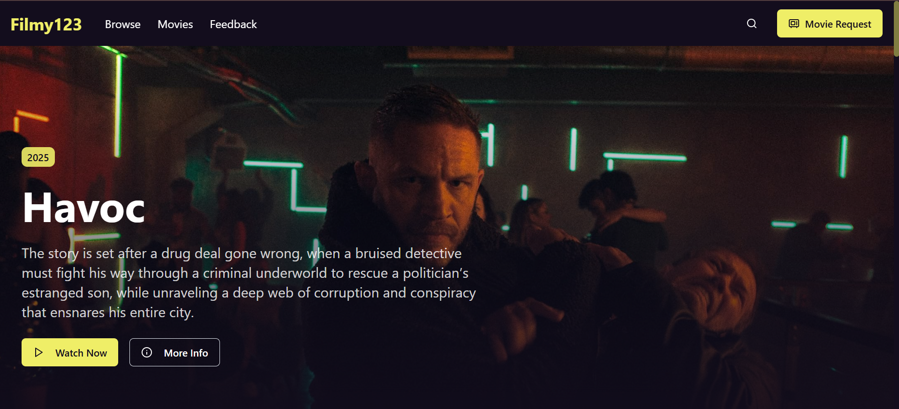
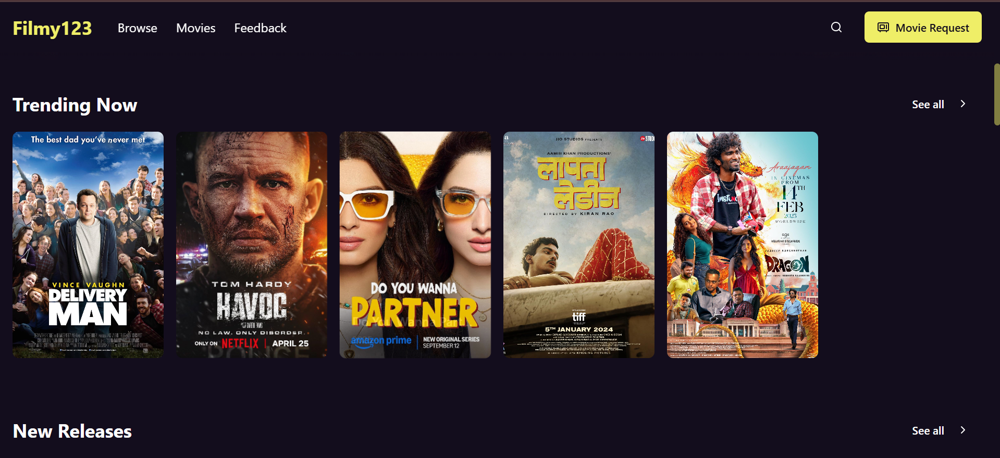
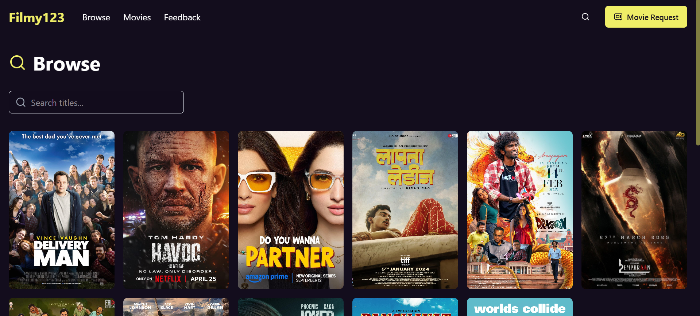
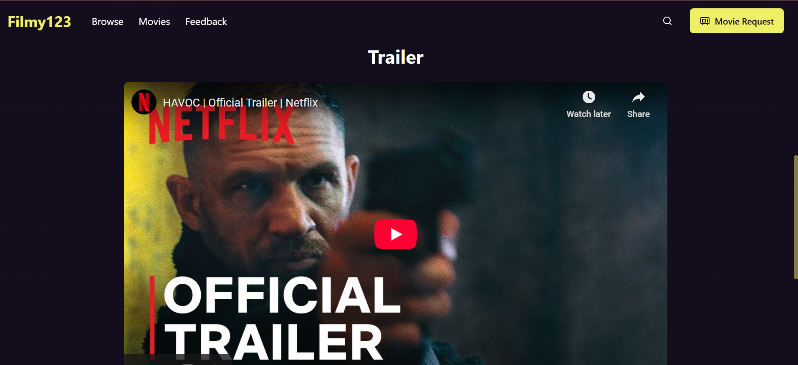
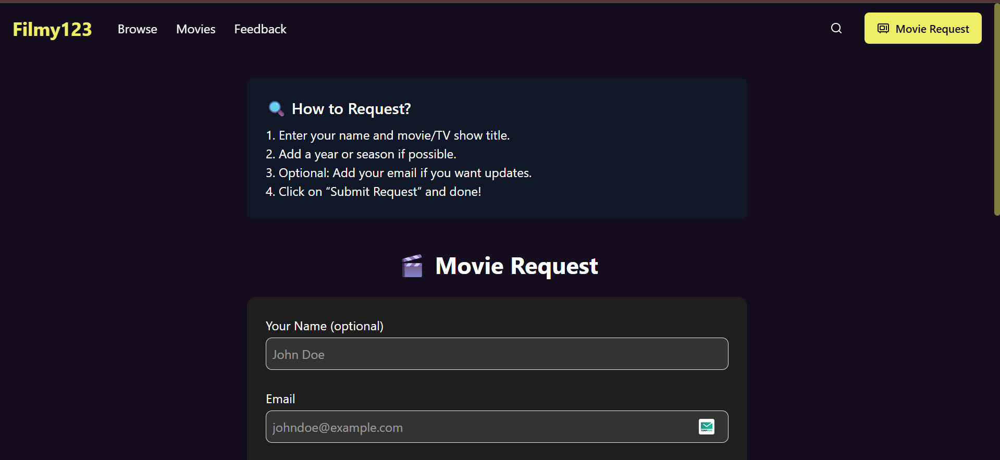
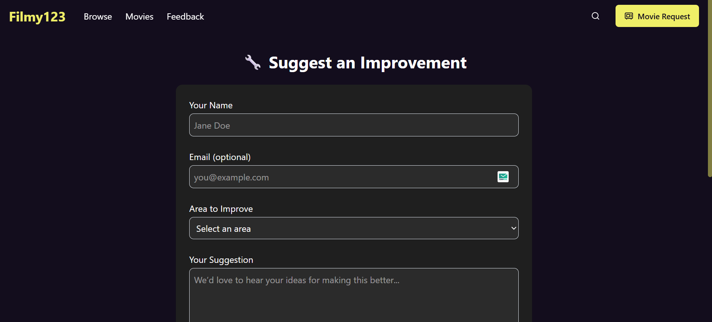

# 🎬 Filmy123 Nextjs Application

**Filmy123** is a modern movie discovery web application built with **Next.js 15**, **TypeScript**, and **shadcn/ui**.  
It allows users to explore movies, view detailed information, browse trends, and enjoy a fast, clean, and responsive UI powered by the latest React and Next.js features.


---

### 🔗 Hosted Link

- Website Link: https://filmy123.vercel.app/
- 
---

### 📸 Screenshot

<p align="center">
  
</p>
<p align="center">
  
</p>
<p align="center">
  
</p>
<p align="center">
  
</p>
<p align="center">
  
</p>
<p align="center">
  
</p>
<p align="center">
  
</p>

---

## 🚀 Features

- 🎥 Browse and explore movies
- 🔍 Search movies with rich details
- 📄 Movie detail pages (cast, release date, ratings, etc.)
- ⚡ Fast rendering with Next.js App Router
- 🎨 Elegant UI using **shadcn/ui** & **Radix UI**
- 📱 Fully responsive design
- 🧠 Form handling with validation

---

### 🛠 Tech Stack

- **Next.js 15** (App Router)
- **React 19**
- **TypeScript**
- **Tailwind CSS**
- **shadcn/ui + Radix UI**

---

### 🚀 Getting Started (Local Setup)

```bash
git clone https://github.com/Honeshwar/filmy123.git
cd filmy123
npm install
npm run dev
